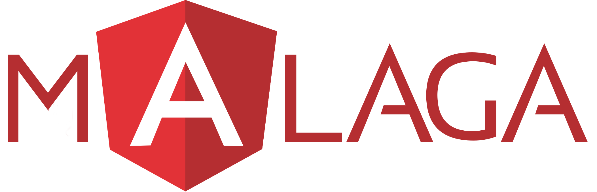

# Segundo Meetup Angular Málaga

## Grupo de Meetup

[Grupo de Meetup "Angular Málaga"](https://www.meetup.com/es-ES/preview/Angular-Malaga).

## Lugar y fecha

:round_pushpin: **Accenture Digital Building**. Calle Severo Ochoa, 21, I+D 6 Sur - Parque Tecnológico Andalucía, 29590 Málaga

:date: Viernes 15 de diciembre de 2017

:clock2: De 18:30h hasta 20:00h

## Programa

### :clock2: 18:30 - 18:50 :speech_balloon: Angular 5 - Novedades

:man: Rubén Triviño

Repaso por las principales novedades de Angular 5.

### :clock2: 18:50 - 19:10 :speech_balloon: Lazy Loading con Angular

:man: Carlos Caballero

Cómo mejorar el rendimiento en el tiempo de carga de tu aplicación.

### :clock2: 19:10 - 19:30 :speech_balloon: PWAs

:man: Pablo Ortuño

Cómo las PWAs pueden ser de interés para nuestra web.

### :clock2: 19:30 - 19:50 :speech_balloon: Animaciones en Angular

 [Luis José Sánchez](https://github.com/LuisJoseSanchez)

Mejora la experiencia de usuario incorporando animaciones en tu aplicación.

### :clock2: 20:00 - 20:30 :beers: Cervezas y socialización.

No es necesario traer portátil ni ningún otro material.
